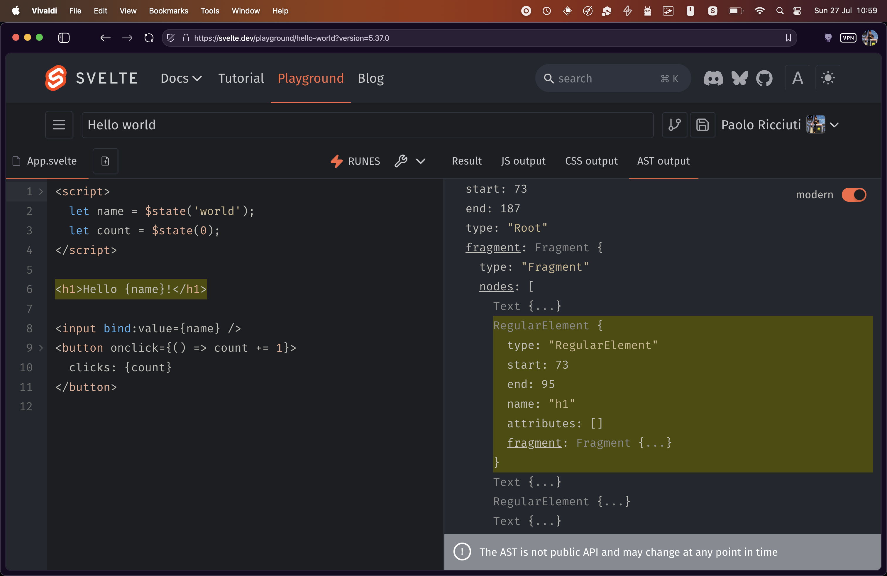

# Developer Guide

The aim of this document is to give a general description of the codebase to those who would like to contribute. It will use technical language and will go deep into the various parts of the codebase.

In the most general sense, Svelte works as follows:

- A component is parsed into an [abstract syntax tree (AST)](https://en.m.wikipedia.org/wiki/Abstract_syntax_tree) compatible with the [ESTree spec](https://github.com/estree/estree)
- The AST is analyzed - defining the scopes, finding stateful variables, etc.
- The AST is transformed, either into a server component or a client component based on the `generate` option. The transformation produces a JS module and some CSS if there's any
- A server component imports the server runtime from `svelte/internal/server` and when executed with `render` produces a string of the `body` and a string of the `head`
- A client component imports the client runtime from `svelte/internal/client` and when executed - either with `mount` or `hydrate` - creates the DOM elements (or retrieves them from the pre-existing DOM in case of hydration), attaches listeners, and creates state and effects that are needed to keep the DOM in sync with the state.

## Phase 1: Parsing

Parsing is the first step to convert the component into a runnable JS file. Your Svelte component is effectively a string and while we could try to do something with regexes and replacements the standard way to do manipulation is to first build an AST and then manipulate that. An AST is a structured representation of code. Each language has its own syntax and relative AST (based on the parser used). Every JavaScript part of a Svelte component, be it the script tag or an expression tag in your template, is parsed with `acorn` (`acorn-typescript` in case you use `lang="ts"`) to produce an ESTree compatible tree.

If you want a more in-depth explanation of how a Parser works, you can refer to [this video](https://www.youtube.com/watch?v=mwvyKGw2CzU) by @tanhauhau where he builds a mini svelte 4 from scratch, but the gist of it is that you can basically have three main operations during the parsing phase: `eat`, `read` and `match` (with some variations).

You start from the first character of the string and try to match it with a known symbol in the language. Considering the shape of a svelte component, you either have an `element` (`<script>`, `<style>` or an HTML element in the template), a `tag` (`{#key}`, `{#if}`, an expression in the template etc) or raw `text`. Once you determine which of the three you are currently parsing, the parse is delegated to specialized functions that know how to handle each of those.

You can `eat` a string to determine which "construct" you are in but don't need any information out of it. For example, if you just matched a `<` in the template you can `eat('!--')` to figure out if what you are dealing with is an HTML comment. The `eat` function will return `true` or `false`, and if it's true it will also advance the current index of the parser by `'!--'.length`. Now that you know that you are inside an HTML comment you can `read` the string until you find a `-->`. The difference between `read` and `eat` is that reading will return the value to you (in this case you need it because you need to store the information about the `data` of the comment in the AST node). Finally, you can eat that `-->` to advance the next three characters, passing the required parameters to throw an error if it's not there (if you open a comment and don't close it, you'll get a syntax error).

All of the above more or less maps to this code:

```js
if (parser.eat('!--')) {
	const data = parser.read_until(regex_closing_comment);
	parser.eat('-->', true);

	parser.append({
		type: 'Comment',
		start,
		end: parser.index,
		data
	});

	return;
}
```

If the parser doesn't enter this `if`, it will check for all the other language constructs using different strategies to read the information that is needed in the AST (an HTML element for example will need the name, the list of arguments, the fragment etc).

If you want to familiarize yourself with the Svelte AST, you can go [to the playground](https://svelte.dev/playground), write your Svelte component and open the `AST Output` tab. This will not only show you the AST of the component but also provide you with hover functionality that will highlight each section of the component when you hover over a section of the AST (and vice versa).



## Phase 2: Analysis

Once we have a AST we need to perform analysis on it. During this phase we will:

- create the scopes for the component
- throw compiler warnings and errors (for things like wrong usage of runes, wrong usage of globals etc)
- detect which branches of the template are completely static or dynamic
- detect which snippets are hoistable
- analyze the css to determine unused css

This information will be used later during the third phase to transform and optimize your component (for example if you declare a stateful variable but never reassign to it or never use it in a reactive context we will not bother with creating a stateful variable at all).

The very first thing to do is to create the scopes for every variable. What this operation does is to create a map from a node to a specific set of references, declarations and declarators. This is useful because if you have a situation like this

```svelte
<script module>
	let count = $state(0);
</script>

<script>
	let count = $state(0);

	function log(count) {
		console.log(count);
	}

	function increase() {
		count++;
	}
</script>

{count}
```

Depending on where you read `count` it will refer to a different variable that has been shadowed. The `count` in the template and in `increase` refers to the `count` declared in instance script, while the one in the `log` function will refer to its argument.

This is done by walking the AST and manually create a `new Scope` class every time we encounter a node that creates one.

<details>
	<summary>What does walking the AST mean?</summary>
	
	As we've seen, the AST is basically a giant JavaScript object with a `type` property to indicate the node type and a series of extra properties.

    For example, a `$state(1)` node will look like this (excluding position information):

    ```js
    {
    	type: "CallExpression",
    	callee: {
    		type: "Identifier",
    		name: "$state",
    	},
    	arguments: [{
    		type: "Literal",
    		value: 1,
    		raw: "1",
    	}]
    }
    ```

    Walking allows you to invoke a function (that's called a visitor) for each of the nodes in the AST, receiving the node itself as an argument.

</details>

Let's see an example: when you declare a function in your code the corresponding AST node is a `FunctionDeclaration`...so if you look into the `create_scopes` function you'll see something like this

```ts
walk(ast, state, {
	// other visitors
	FunctionDeclaration(node, { state, next }) {
		if (node.id) state.scope.declare(node.id, 'normal', 'function', node);

		const scope = state.scope.child();
		scopes.set(node, scope);

		add_params(scope, node.params);
		next({ scope });
	}
	// other visitors
});
```

What this snippet of code is doing is:

- checking if the function declaration has an identifier (i.e. if it's a named function - not an anonymous function)
- if it does have an identifier, it's declaring a new variable in the current scope
- creating a new scope (since in JavaScript when you create a function you are creating a new lexical scope) with the current scope as the parent
- declare every argument of the function in the newly created scope
- invoking the next method that will continue the AST traversal, with the brand new scope as the current scope

The same is obviously true for Svelte-specific nodes too: the `SnippetBlock` visitor looks basically identical to the `FunctionDeclaration` one:

```ts
walk(ast, state, {
	// other visitors
	SnippetBlock(node, context) {
		const state = context.state;
		let scope = state.scope;

		scope.declare(node.expression, 'normal', 'function', node);

		const child_scope = state.scope.child();
		scopes.set(node, child_scope);

		for (const param of node.parameters) {
			for (const id of extract_identifiers(param)) {
				child_scope.declare(id, 'snippet', 'let');
			}
		}

		context.next({ scope: child_scope });
	}
	// other visitors
});
```

After the initial walk to figure out the right scopes we can now walk once again, we use a generic visitor (that runs before any visit to a node) to pass down the appropriate scope to the node (and collect information about the `// svelte-ignore` comments):

```ts
const visitors = {
	_(node, { state, next, path }) {
		const parent = path.at(-1);

		/** @type {string[]} */
		const ignores = [];

		// logic to collect svelte-ignore excluded for brevity

		const scope = state.scopes.get(node);
		next(scope !== undefined && scope !== state.scope ? { ...state, scope } : state);

		if (ignores.length > 0) {
			pop_ignore();
		}
	}
	// rest of the visitors
};
```

This means that in every visitor we can access the `scope` property and ask information about every variable by name.

Let's see an example of how this is used in the `Component` visitor

```ts
export function Component(node, context) {
	const binding = context.state.scope.get(
		node.name.includes('.') ? node.name.slice(0, node.name.indexOf('.')) : node.name
	);

	node.metadata.dynamic =
		context.state.analysis.runes && // Svelte 4 required you to use svelte:component to switch components
		binding !== null &&
		(binding.kind !== 'normal' || node.name.includes('.'));

	visit_component(node, context);
}
```

We invoke `scope.get` passing `node.name` (or the substring that goes from the start to the first `.` in case the component looks like this `<Component.Value />`)... what we get back is a `Binding` which contains the information about where the variable for that component was declared (or imported).

If we are in runes mode, the `binding` is not `null`, and the `binding.kind` is not `normal` (which means a regular non stateful variable) then we set the `metadata.dynamic` for this component to `true`. We will use this during the transformation phase to generate the proper code to remount the component when the variable changes.

The analysis phase is also the moment most of the compiler warnings/errors are emitted. For example if we notice that some top level reference starts with `$$` (which is prohibited) we throw a `global_reference_invalid`

```ts
for (const [name, references] of module.scope.references) {
	if (name[0] !== '$' || RESERVED.includes(name)) continue;
	if (name === '$' || name[1] === '$') {
		e.global_reference_invalid(references[0].node, name);
	}
	// rest of the code to also create synthetic bindings for the store, omitted for brevity
}
```

Or if you try to assign to a variable that was not declared with state and it's used in the template we console.warn a `non_reactive_update` (you can also see the scopes in use once again)

```ts
// warn on any nonstate declarations that are a) reassigned and b) referenced in the template
for (const scope of [module.scope, instance.scope]) {
	outer: for (const [name, binding] of scope.declarations) {
		if (binding.kind === 'normal' && binding.reassigned) {
			inner: for (const { path } of binding.references) {
				if (path[0].type !== 'Fragment') continue;
				for (let i = 1; i < path.length; i += 1) {
					const type = path[i].type;
					if (
						type === 'FunctionDeclaration' ||
						type === 'FunctionExpression' ||
						type === 'ArrowFunctionExpression'
					) {
						continue inner;
					}
					// bind:this doesn't need to be a state reference if it will never change
					if (
						type === 'BindDirective' &&
						/** @type {AST.BindDirective} */ path[i].name === 'this'
					) {
						for (let j = i - 1; j >= 0; j -= 1) {
							const type = path[j].type;
							if (
								type === 'IfBlock' ||
								type === 'EachBlock' ||
								type === 'AwaitBlock' ||
								type === 'KeyBlock'
							) {
								w.non_reactive_update(binding.node, name);
								continue outer;
							}
						}
						continue inner;
					}
				}

				w.non_reactive_update(binding.node, name);
				continue outer;
			}
		}
	}
}
```

### CSS Analysis

While we didn't go deep in how the analysis works for every single step of the analysis it's worth exploring the CSS analysis a bit more in depth. This phase in itself is subdivided in three phases: we first analyze the css, during this phase we validate the structure of svelte specific css (eg. the `:global` selector) is valid also marking every node within global as `used`. We then proceed to `prune` the css. In this phase we match every selector with the html structure...if a selector doesn't match any element we `prune` it away either by commenting it out in dev (so that the users can actually see what's being removed) or by completely remove it in prod. Finally we walk the css AST once more to warn about all the `unused` css nodes accessing the metadata we collected in those two phases.

## Phase 3: Transform

After the analysis phase we can now move to the last compilation phase: the transform. However this phase is really two phases: svelte components generate completely different code based on the `compilerOption.generate` option...the function is small enough that we can just dump it here

```ts
export function transform_component(analysis, source, options) {
	if (options.generate === false) {
		return {
			js: /** @type {any} */ null,
			css: null,
			warnings: state.warnings, // set afterwards
			metadata: {
				runes: analysis.runes
			},
			ast: /** @type {any} */ null // set afterwards
		};
	}

	const program =
		options.generate === 'server'
			? server_component(analysis, options)
			: client_component(analysis, options);

	const js_source_name = get_source_name(options.filename, options.outputFilename, 'input.svelte');

	const js = print(/** @type {Node} */ program, ts({ comments: analysis.comments }), {
		// include source content; makes it easier/more robust looking up the source map code
		// (else esrap does return null for source and sourceMapContent which may trip up tooling)
		sourceMapContent: source,
		sourceMapSource: js_source_name
	});

	merge_with_preprocessor_map(js, options, js_source_name);

	const css =
		analysis.css.ast && !analysis.inject_styles
			? render_stylesheet(source, analysis, options)
			: null;

	return {
		js,
		css,
		warnings: state.warnings, // set afterwards. TODO apply preprocessor sourcemap
		metadata: {
			runes: analysis.runes
		},
		ast: /** @type {any} */ null // set afterwards
	};
}
```

As you can see the key part of this function is this bit here

```ts
const program =
	options.generate === 'server'
		? server_component(analysis, options)
		: client_component(analysis, options);
```

Here we just delegate to it's own method to generate either a client component or a server component. Before we jump into exploring those two let's take a look at the output of the compilation of a very simple counter component.

```svelte
<script>
	let count = $state(0);
</script>

<button onclick={() => (count += 1)}>
	clicks: {count}
</button>
```

here's the compiled output for the client

```ts
import 'svelte/internal/disclose-version';
import 'svelte/internal/flags/async';
import * as $ from 'svelte/internal/client';

var on_click = (_, count) => $.set(count, $.get(count) + 1);
var root = $.from_html(`<button> </button>`);

export default function App($$anchor) {
	let count = $.state(0);
	var button = root();

	button.__click = [on_click, count];

	var text = $.child(button);

	$.reset(button);
	$.template_effect(() => $.set_text(text, `clicks: ${$.get(count) ?? ''}`));
	$.append($$anchor, button);
}

$.delegate(['click']);
```

and here's the one for the server

```ts
import * as $ from 'svelte/internal/server';

export default function App($$payload) {
	let count = 0;

	$$payload.out.push(`<button>clicks: ${$.escape(count)}</button>`);
}
```

As you can see the server mostly concern itself with generating the html for the component, runes are basically removed, event listeners just vanish. It makes sense because on the server we don't add any listener, we just produce the html that will be hydrated by the client component.

Let's start from the simpler of the two...

### Transform server component
