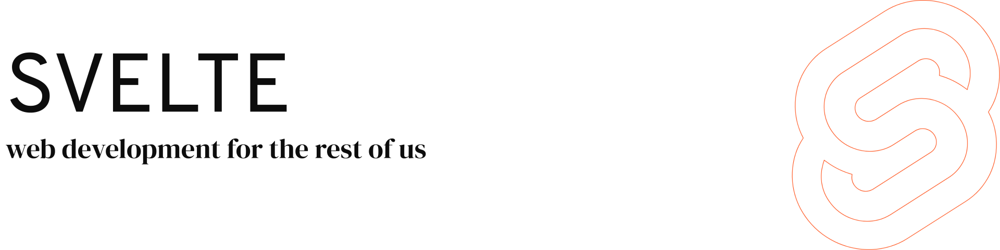

<a href="https://svelte.dev">
	<picture>
		<source media="(prefers-color-scheme: dark)" srcset="assets/banner_dark.png">
		
	</picture>
</a>

[](LICENSE.md) [](https://svelte.dev/chat)

## 什么是 Svelte？

Svelte 是一种构建 Web 应用程序的新方式。它是一个编译器，将你的声明式组件转换为高效的 JavaScript，精确地更新 DOM。

了解更多请访问 [Svelte 网站](https://svelte.dev)，或者加入 [Discord 聊天室](https://svelte.dev/chat)。

## 特性

- 🚀 **编译时优化**：在构建时处理框架代码，运行时几乎没有开销
- 📦 **极小的包大小**：生成的代码非常小
- 🎯 **真正的响应式**：不需要虚拟 DOM，直接更新 DOM
- 🎨 **简洁的语法**：易于学习和使用
- 🔧 **强大的功能**：支持动画、过渡、绑定等
- 📱 **跨平台**：可用于 Web、移动端和桌面端

## 安装

### 使用 npm

```bash
npm create svelte@latest
```

### 使用 yarn

```bash
yarn create svelte
```

### 使用 pnpm

```bash
pnpm create svelte
```

## 快速开始

### 创建项目

```bash
npm create svelte@latest my-app
cd my-app
npm install
npm run dev
```

### 基本组件

```svelte
<script>
  let count = $state(0);
  
  function increment() {
    count += 1;
  }
</script>

<button on:click={increment}>
  点击次数: {count}
</button>
```

### 响应式声明

```svelte
<script>
  let count = $state(0);
  let doubled = $derived(count * 2);
  
  function increment() {
    count += 1;
  }
</script>

<button on:click={increment}>
  点击次数: {count}，双倍: {doubled}
</button>
```

### 条件渲染

```svelte
<script>
  let loggedIn = $state(false);
  
  function toggle() {
    loggedIn = !loggedIn;
  }
</script>

<button on:click={toggle}>
  {loggedIn ? '退出' : '登录'}
</button>

{#if loggedIn}
  <p>欢迎回来！</p>
{:else}
  <p>请登录</p>
{/if}
```

### 列表渲染

```svelte
<script>
  let items = $state(['苹果', '香蕉', '橙子']);
</script>

<ul>
  {#each items as item}
    <li>{item}</li>
  {/each}
</ul>
```

### 事件处理

```svelte
<script>
  let name = $state('');
  
  function handleSubmit() {
    alert(`你好，${name}！`);
  }
</script>

<form on:submit|preventDefault={handleSubmit}>
  <input bind:value={name} placeholder="输入你的名字">
  <button type="submit">提交</button>
</form>
```

### 绑定

```svelte
<script>
  let value = $state('');
  let checked = $state(false);
  let selected = $state('');
</script>

<!-- 文本输入 -->
<input bind:value={value}>
<p>输入的值: {value}</p>

<!-- 复选框 -->
<input type="checkbox" bind:checked={checked}>
<p>选中: {checked}</p>

<!-- 选择框 -->
<select bind:value={selected}>
  <option value="">请选择</option>
  <option value="apple">苹果</option>
  <option value="banana">香蕉</option>
</select>
<p>选择的: {selected}</p>
```

### 生命周期

```svelte
<script>
  import { onMount, onDestroy } from 'svelte';
  
  let data = $state(null);
  
  onMount(async () => {
    const response = await fetch('/api/data');
    data = await response.json();
  });
  
  onDestroy(() => {
    console.log('组件已销毁');
  });
</script>

{#if data}
  <p>{data.message}</p>
{:else}
  <p>加载中...</p>
{/if}
```

### 存储

```svelte
<script>
  import { writable } from 'svelte/store';
  
  const count = writable(0);
  
  function increment() {
    count.update(n => n + 1);
  }
</script>

<button on:click={increment}>
  点击次数: {$count}
</button>
```

### 动画

```svelte
<script>
  import { fade, fly } from 'svelte/transition';
  
  let visible = $state(true);
  
  function toggle() {
    visible = !visible;
  }
</script>

<button on:click={toggle}>切换</button>

{#if visible}
  <div transition:fade>
    淡入淡出动画
  </div>
{/if}

{#if visible}
  <div transition:fly={{ y: 200, duration: 1000 }}>
    飞入动画
  </div>
{/if}
```

### 组件

```svelte
<!-- Button.svelte -->
<script>
  let { onclick, children } = $props();
</script>

<button on:click={onclick}>
  {children}
</button>

<!-- App.svelte -->
<script>
  import Button from './Button.svelte';
  
  function handleClick() {
    alert('按钮被点击！');
  }
</script>

<Button onclick={handleClick}>
  点击我
</Button>
```

## 与 React 的比较

| 特性 | Svelte | React |
|------|--------|-------|
| 编译时 | 是 | 否 |
| 虚拟 DOM | 否 | 是 |
| 包大小 | 小 | 大 |
| 学习曲线 | 低 | 中等 |
| 性能 | 高 | 中等 |
| 语法 | 简洁 | JSX |

## 与 Vue 的比较

| 特性 | Svelte | Vue |
|------|--------|-----|
| 编译时 | 是 | 否 |
| 虚拟 DOM | 否 | 是 |
| 包大小 | 小 | 中等 |
| 学习曲线 | 低 | 低 |
| 性能 | 高 | 高 |
| 语法 | 简洁 | 模板 |

## 框架集成

### SvelteKit

SvelteKit 是 Svelte 的官方应用框架：

```bash
npm create svelte@latest my-app
cd my-app
npm install
npm run dev
```

### Vite

Svelte 与 Vite 完美集成：

```bash
npm create vite@latest my-app -- --template svelte
```

## 部署

### 静态部署

```bash
npm run build
# 将 build 目录部署到静态托管服务
```

### Node.js 服务器

```bash
npm run build
node build
```

## 文档

完整文档请访问 [svelte.dev](https://svelte.dev)。

## 社区

如需帮助、讨论最佳实践或功能建议：

[在 Discord 上讨论 Svelte](https://svelte.dev/chat)

## 支持 Svelte

Svelte 是一个 MIT 许可的开源项目，其持续开发完全由出色的志愿者完成。如果你想支持他们的努力，请考虑：

- [在 Open Collective 上成为支持者](https://opencollective.com/svelte)。

通过 Open Collective 捐赠的资金将用于支付与 Svelte 开发相关的费用，如托管成本。如果收到足够的捐款，资金也可能用于更直接地支持 Svelte 的开发。

## 路线图

如果你想查看我们目前正在做什么，可以查看[我们的路线图](https://svelte.dev/roadmap)。

## 贡献

请参阅[贡献指南](CONTRIBUTING.md)和 [`svelte`](packages/svelte) 包了解如何为 Svelte 做出贡献。

## 许可证

[MIT](LICENSE.md)
