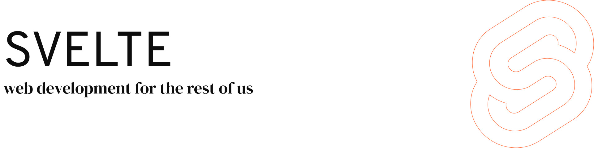

<a href="https://svelte.dev">
	<picture>
		<source media="(prefers-color-scheme: dark)" srcset="assets/banner_dark.png">
		
	</picture>
</a>

 

## What is Svelte?

Svelte is a new way to build web applications. It's a compiler that takes your declarative components and converts them into efficient JavaScript that surgically updates the DOM.

Learn more at the [Svelte website](https://svelte.dev), or stop by the [Discord chatroom](https://svelte.dev/chat).

## Supporting Svelte

Svelte is an MIT-licensed open source project with its ongoing development made possible entirely by fantastic volunteers. If you'd like to support their efforts, please consider:

- [Becoming a backer on Open Collective](https://opencollective.com/svelte).

Funds donated via Open Collective will be used for compensating expenses related to Svelte's development such as hosting costs. If sufficient donations are received, funds may also be used to support Svelte's development more directly.

## Roadmap

You may view [our roadmap](https://svelte.dev/roadmap) if you'd like to see what we're currently working on.

## Contributing

Please see the [Contributing Guide](CONTRIBUTING.md) and the [`svelte`](packages/svelte) package for information on contributing to Svelte.

## Is svelte.dev down?

Probably not, but it's possible. If you can't seem to access any `.dev` sites, check out [this SuperUser question and answer](https://superuser.com/q/1413402).

## License

[MIT](LICENSE.md)

## 🌐 Web Resources & Interactive Index
- [CATEGORY PUZZLE 10](https://quizverses.github.io/category-puzzle-10.html)
- [SODA BLOCK JAM](https://ilearnworlds.github.io/soda-block-jam.html)
- [HOLE BATTLEIO](https://studyplayings.pages.dev/hole-battleio.html)
- [CATEGORY MATCH 3](https://studyquesthub.web.app/category-match-3.html)
- [CATEGORY PUZZLE](https://quizverses.pages.dev/category-puzzle.html)
- [INDEX24](https://studyquests.github.io/index24.html)
- [BARBEE MET GALA TRANSFORMATION](https://quizverses.pages.dev/barbee-met-gala-transformation.html)
- [VIBE COLOURING](https://quizverses-9d2f2.web.app/vibe-colouring.html)
- [SNIPER FOR BRAINROT](https://quizverses.pages.dev/sniper-for-brainrot.html)
- [POTION SORT](https://quizverses.pages.dev/potion-sort.html)
- [DIVINEX](https://quizverses.pages.dev/divinex.html)
- [CRAZY SCREW KING](https://quizverses.github.io/crazy-screw-king.html)
- [GLACIER RUSH](https://quizverses.github.io/glacier-rush.html)
- [CATEGORY CAR](https://studyquests.github.io/category-car.html)
- [PERFECT TIDY](https://quizverses.pages.dev/perfect-tidy.html)
- [YUMMY TALES 4](https://quizverses.pages.dev/yummy-tales-4.html)
- [CATEGORY PLATFORM260](https://quizverses.pages.dev/category-platform260.html)
- [CATEGORY SIDE SCROLLING184](https://quizverses.pages.dev/category-side-scrolling184.html)
- [CATEGORY WEB PROXY](https://quizverses.pages.dev/category-web-proxy.html)
- [OFFROAD LIFE 3D](https://quizverses.github.io/offroad-life-3d.html)
- [CATEGORY SIMULATION](https://quizverses.pages.dev/category-simulation.html)
- [CATEGORY SIDE SCROLLING184](https://studyquests.github.io/category-side-scrolling184.html)
- [CATEGORY FPS](https://studyquests.github.io/category-fps.html)
- [SCARY BABY YELLOW GAME](https://quizverses.pages.dev/scary-baby-yellow-game.html)
- [CATEGORY SPACE57](https://quizverses.pages.dev/category-space57.html)
- [CARJAMCOLOR](https://quizverses.pages.dev/carjamcolor.html)
- [INDEX29](https://studyquests.github.io/index29.html)
- [ORGANIZER MASTER](https://quizverses.pages.dev/organizer-master.html)
- [BUBILOONS](https://studyquests.github.io/bubiloons.html)
- [CATEGORY BLOCK91](https://studyquesthub.web.app/category-block91.html)
- [CATEGORY PHYSICS371](https://studyquesthub.web.app/category-physics371.html)
- [CATEGORY PUZZLE](https://thelearnquester.web.app/category-puzzle.html)
- [HEXAMATCH](https://studyplayings.pages.dev/hexamatch.html)
- [CANDY MATCH PUZZLE](https://learnquester.github.io/candy-match-puzzle.html)
- [CATEGORY COLLECT565](https://thelearnquester.web.app/category-collect565.html)
- [CATEGORY SURVIVAL366](https://quizverses.pages.dev/category-survival366.html)
- [CATEGORY 204828](https://thelearnquester.web.app/category-204828.html)
- [CATEGORY UNBLOCKERS](https://quizverses.pages.dev/category-unblockers.html)
- [CATEGORY SHOOTER 2](https://studyplayings.pages.dev/category-shooter-2.html)
- [CATEGORY MAHJONG](https://studyplayings.pages.dev/category-mahjong.html)
- [3D CHESS MASTER](https://thelearnquester.web.app/3d-chess-master.html)
- [DRAGON DRAW JOUST](https://studyquests.github.io/dragon-draw-joust.html)
- [KINGS AND QUEENS MAHJONG](https://studyquests.github.io/kings-and-queens-mahjong.html)
- [FEED ME MONSTERS IDLE BATTLE](https://studyplayings.pages.dev/feed-me-monsters-idle-battle.html)
- [CATEGORY TOWER DEFENSE 2](https://quizverses.pages.dev/category-tower-defense-2.html)
- [CATEGORY 2D1 070](https://learnquester.pages.dev/category-2d1-070.html)
- [BLACK PINK CHRISTMAS CONCERT](https://studyplayings.pages.dev/black-pink-christmas-concert.html)
- [SAVE THE DADDY](https://quizverses-9d2f2.web.app/save-the-daddy.html)
- [CATEGORY SCHOOL UNBLOCKER](https://quizverses.pages.dev/category-school-unblocker.html)
- [INDEX3](https://thelearnquester.web.app/index3.html)
- [BRICKS BALLS BREAKER](https://quizverses.pages.dev/bricks-balls-breaker.html)
- [HIDDEN OBJECT ROOMS EXPLORATION](https://studyquesthub.web.app/hidden-object-rooms-exploration.html)
- [CATEGORY 2D1 070](https://studyplayings.pages.dev/category-2d1-070.html)
- [DUCKLINGS](https://quizverses.github.io/ducklings.html)
- [BULL RUNNER](https://learnquester.pages.dev/bull-runner.html)
- [ASSASSIN COMMANDO CAR DRIVING](https://studyplayings.pages.dev/assassin-commando-car-driving.html)
- [CATEGORY WEBGAME](https://learnquester.pages.dev/category-webgame.html)
- [MINI OBBY WAR GAME](https://quizverses-9d2f2.web.app/mini-obby-war-game.html)
- [CUBE CONNECT](https://studyplayings.web.app/cube-connect.html)
- [ZOMBIE DRIVER](https://quizverses.github.io/zombie-driver.html)
- [OKAY](https://quizverses-9d2f2.web.app/okay.html)
- [CATEGORY MONSTER206](https://quizverses-9d2f2.web.app/category-monster206.html)
- [CATEGORY PREMIUM PERKS74](https://quizverses.pages.dev/category-premium-perks74.html)
- [CATEGORY ANIMAL215](https://studyquesthub.web.app/category-animal215.html)
- [WINTER WOLF](https://studyplaying.github.io/winter-wolf.html)
- [DARTS JAM](https://quizverses.github.io/darts-jam.html)
- [JIGSOLITAIRE](https://quizverses-9d2f2.web.app/jigsolitaire.html)
- [COUNT ESCAPE RUSH](https://studyquests.pages.dev/count-escape-rush.html)
- [CATEGORY MAKEUP](https://studyplaying.github.io/category-makeup.html)
- [GOO SLIME JUMP](https://quizverses.github.io/goo-slime-jump.html)
- [CRAZY BUBBLE BREAKER](https://quizverses-9d2f2.web.app/crazy-bubble-breaker.html)
- [ZOMBIE RAFT](https://studyquesthub.web.app/zombie-raft.html)
- [MOTO TRAFFIC RIDER](https://studyquesthub.web.app/moto-traffic-rider.html)
- [SWORDSMAN ADVENTURE](https://studyquests.pages.dev/swordsman-adventure.html)
- [CATEGORY STRATEGY](https://learnquester.github.io/category-strategy.html)
- [ROCKET FEST](https://thelearnquester.web.app/rocket-fest.html)
- [BOMBER BATTLE ARENA](https://quizverses.pages.dev/bomber-battle-arena.html)
- [CATEGORY BASKETBALL](https://studyquesthub.web.app/category-basketball.html)
- [MATH MASTER](https://studyplaying.github.io/math-master.html)
- [CATEGORY CASUAL969](https://thelearnquester.web.app/category-casual969.html)
- [LOVIE CHICS COACHELLA FESTIVAL](https://studyplayings.pages.dev/lovie-chics-coachella-festival.html)
- [FOOT CHINKO RUSSIA 2018](https://studyplaying.github.io/foot-chinko-russia-2018.html)
- [PRIVACY](https://studyquesthub.web.app/privacy.html)
- [ERASE THE EXTRA ELEMENT](https://studyplaying.github.io/erase-the-extra-element.html)
- [VAMPIRIC ROULETTE ROMANCE](https://studyquests.pages.dev/vampiric-roulette-romance.html)
- [KNOCKOUT DUDES](https://quizverses.github.io/knockout-dudes.html)
- [ROAD OF FURY 4](https://studyquests.pages.dev/road-of-fury-4.html)
- [CATEGORY UNBLOCKED](https://quizverses.pages.dev/category-unblocked.html)
- [CATEGORY DRAWING GAME](https://thelearnquester.web.app/category-drawing-game.html)
- [CATEGORY RESTAURANT64](https://learnquester.github.io/category-restaurant64.html)
- [CATEGORY RACING DRIVING 2](https://quizverses.pages.dev/category-racing-driving-2.html)
- [SNIPER MASTER](https://studyplaying.github.io/sniper-master.html)
- [CATEGORY CASUAL 4](https://studyquests.github.io/category-casual-4.html)
- [CATEGORY AVOID](https://learnquester.github.io/category-avoid.html)
- [LAST UFO DEFENSE](https://studyquests.pages.dev/last-ufo-defense.html)
- [CATEGORY CRAFTING45](https://quizverses-9d2f2.web.app/category-crafting45.html)
- [CATEGORY RPG](https://studyquests.pages.dev/category-rpg.html)
- [CATEGORY RESTAURANT64](https://studyquesthub.web.app/category-restaurant64.html)
- [CATEGORY UNBLOCKER](https://quizverses.pages.dev/category-unblocker.html)
- [CATEGORY CAR 2](https://studyplayings.pages.dev/category-car-2.html)
- [VOLLEY BEAN](https://quizverses-9d2f2.web.app/volley-bean.html)
- [INDEX3](https://studyplayings.web.app/index3.html)
- [CRAZY ZOO SWIPE MATCH 3 PUZZLE GAME](https://quizverses.github.io/crazy-zoo-swipe-match-3-puzzle-game.html)
- [CATEGORY CAR](https://studyplayings.pages.dev/category-car.html)
- [BLOCKSSS](https://studyplayings.pages.dev/blocksss.html)
- [AIRPORT MASTER PLANE TYCOON](https://quizverses.github.io/airport-master-plane-tycoon.html)
- [AIRPORT SIMULATOR PLANE TYCOON](https://quizverses.pages.dev/airport-simulator-plane-tycoon.html)
- [HARVESTING VEGGIES](https://learnquester.github.io/harvesting-veggies.html)
- [QUIZ SQUID ROUND](https://studyquests.github.io/quiz-squid-round.html)
- [CATEGORY CASUAL 7](https://learnquester.github.io/category-casual-7.html)
- [SAVE STRANDING FISH](https://quizverses.pages.dev/save-stranding-fish.html)
- [EMOJI SORT FUN PUZZLE GAME](https://quizverses.github.io/emoji-sort-fun-puzzle-game.html)
- [ACE CAR RACING](https://quizverses.pages.dev/ace-car-racing.html)
- [PUMPKING VS MUMMY](https://quizverses.github.io/pumpking-vs-mummy.html)
- [PRIVACY](https://studyplayings.web.app/privacy.html)
- [NUBIK COURIER AN OPEN WORLD](https://quizverses.pages.dev/nubik-courier-an-open-world.html)
- [CATEGORY POINT AND CLICK123](https://quizverses.pages.dev/category-point-and-click123.html)
- [PET SALON](https://quizverses.github.io/pet-salon.html)
- [INDEX30](https://studyquests.github.io/index30.html)
- [CATEGORY CASUAL](https://studyquests.pages.dev/category-casual.html)
- [PRIVACY](https://studyquests.github.io/privacy.html)
- [ZOMBIE ROYALE IO](https://quizverses.github.io/zombie-royale-io.html)
- [SAVE BABY CAPYBARAS PULL PIN](https://studyplaying.github.io/save-baby-capybaras-pull-pin.html)
- [CATEGORY SHOOTER 2](https://quizverses.pages.dev/category-shooter-2.html)
- [HEAT INCREMENTAL](https://studyquests.github.io/heat-incremental.html)
- [FOOTBALL PENALTY](https://studyplayings.pages.dev/football-penalty.html)
- [IDLE MONEY FACTORY](https://studyplaying.github.io/idle-money-factory.html)
- [JELLY MATH 3D](https://studyquests.github.io/jelly-math-3d.html)
- [SITEMAP](https://studyplayings.web.app/sitemap.html)
- [BLOCK MASTER SUPER PUZZLE](https://studyplayings.pages.dev/block-master-super-puzzle.html)
