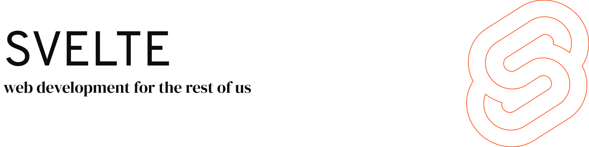

<a href="https://svelte.dev">
	<picture>
		<source media="(prefers-color-scheme: dark)" srcset="assets/banner_dark.png">
		
	</picture>
</a>

 

## What is Svelte?

Svelte is a new way to build web applications. It's a compiler that takes your declarative components and converts them into efficient JavaScript that surgically updates the DOM.

Learn more at the [Svelte website](https://svelte.dev), or stop by the [Discord chatroom](https://svelte.dev/chat).

### How does `svelte` work?

Check out this interactive walkthrough of the `svelte` codebase on CodeCanvas [here](https://www.code-canvas.com/?session=unauthenticatedGithub&repo=svelte&owner=sveltejs&branch=main&OnboardingTutorial=true).

To update the diagram, follow the quick tutorial [here](https://docs.code-canvas.com/updating-diagram).

## Supporting Svelte

Svelte is an MIT-licensed open source project with its ongoing development made possible entirely by fantastic volunteers. If you'd like to support their efforts, please consider:

- [Becoming a backer on Open Collective](https://opencollective.com/svelte).

Funds donated via Open Collective will be used for compensating expenses related to Svelte's development such as hosting costs. If sufficient donations are received, funds may also be used to support Svelte's development more directly.

## Roadmap

You may view [our roadmap](https://svelte.dev/roadmap) if you'd like to see what we're currently working on.

## Contributing

Please see the [Contributing Guide](CONTRIBUTING.md) and the [`svelte`](packages/svelte) package for information on contributing to Svelte.

## Is svelte.dev down?

Probably not, but it's possible. If you can't seem to access any `.dev` sites, check out [this SuperUser question and answer](https://superuser.com/q/1413402).

## License

[MIT](LICENSE.md)
